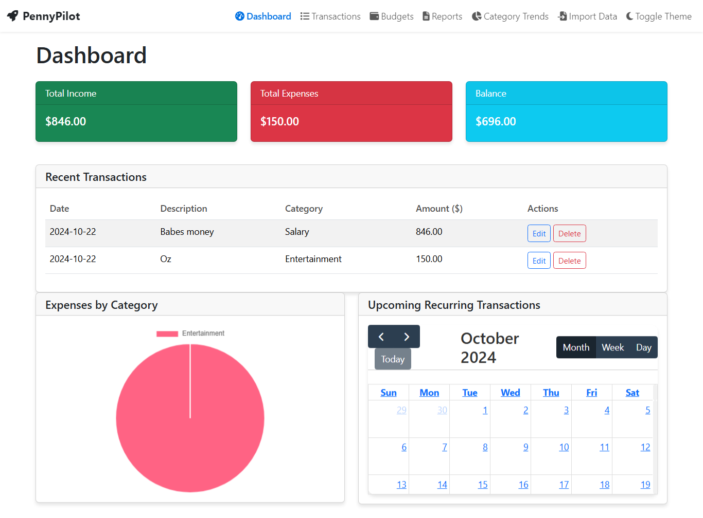
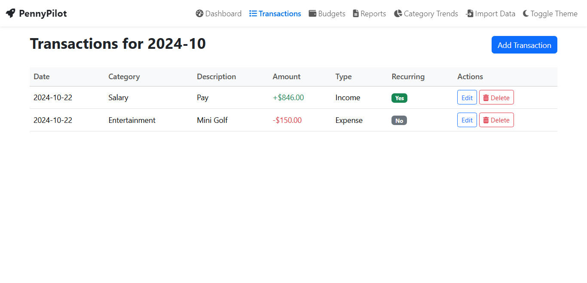
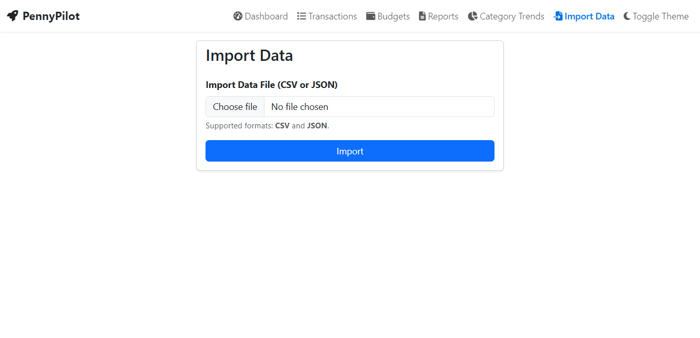

# **PennyPilot - Personal Finance Management App**

PennyPilot is a personal finance management desktop application designed to help users track their transactions, manage budgets, and monitor recurring expenses. With a sleek interface built using Flask (Python) and Bootstrap, PennyPilot offers visual reports and tools to provide a comprehensive overview of your financial health.

---

## **Table of Contents**

1. [Features](#features)
2. [Installation](#installation)
3. [Usage](#usage)
4. [Project Structure](#project-structure)
5. [Screenshots](#screenshots)
6. [Contributing](#contributing)
7. [License](#license)
8. [Contact](#contact)

---

## **Features**

- **Transaction Management:** 
  - Add, edit, and delete transactions across multiple categories (e.g., Food, Rent, Utilities).
  
- **Recurring Transactions:** 
  - Automatically manage recurring transactions with support for daily, weekly, and monthly frequencies.
  - Simplifies your personal finances, can be used for Income, Subscriptions or other frequent payments.
  
- **Budget Tracking:** 
  - Create and track budgets for different categories, and receive alerts when approaching or exceeding budget limits.
  
- **Dashboard Overview:** 
  - Get a quick glance at total income, expenses, and current balance, as well as a calendar view of recurring transactions, a pie chart of expenses by category, and a table of recent transactions/upcoming transactions.
  
- **Data Import/Export:** 
  - Import transaction data from CSV or JSON files and *export your data for backup or analysis.

    **Export functionality is yet to be implemented.

- **Visualizations and Reports:** 
  - Display monthly, quarterly, and yearly financial reports, based on start and end dates.

    **Visualization functionality is yet to be implemented.

---

## **Installation**

### **Prerequisites**

- Python 3.x

### **Steps:**

1. **Clone the Repository:**

    
    git clone https://github.com/mersinatra/PennyPilot.git

    cd PennyPilot

    

2. **Set Up a Virtual Environment:**

    
    python -m venv venv

    source venv/bin/activate
 # Windows: venv\Scripts\activate
    

3. **Install Dependencies:**

    
    pip install -r requirements.txt
    

4. **Run the Application:**

    
    python main.py
    

---

## **Usage**

### **1. Transaction Management**

- **Adding a Transaction:** 
  - Navigate to the **Transactions** tab, and click "Add Transaction." Fill in the amount, date, category, and any additional notes, then save.

- **Editing or Deleting a Transaction:** 
  - Right-click on an existing transaction to edit or delete it.

### **2. Recurring Transactions**

- **Setting Up Recurring Transactions:** 
  - In the **Recurring** tab, select "New Recurring Transaction." Define the amount, frequency (daily, weekly, monthly), and start/end dates.

### **3. Budget Tracking**

- **Creating Budgets:** 
  - In the **Budgets** tab, create a new budget by selecting the category and setting the desired budget amount for a specific period (e.g., monthly).

- **Monitoring Budgets:** 
  - Check the dashboard or the **Budgets** tab to see how close you are to reaching your budget limits for each category.

### **4. Data Import/Export**

- **Importing Data:** 
  - Navigate to the **File** menu, select "Import Data," and choose a CSV or JSON file to import.

- **Exporting Data:** 
  - Use the "Export Data" option in the **File** menu to back up your transactions as CSV or JSON files.

### **5. Dashboard Overview**

- The dashboard displays your total income, expenses, and current balance, along with graphical visualizations of your spending habits.

### **6. Visual Reports**

- **Expense Breakdown:** 
  - View a pie chart of your expenses by category.
  
- **Category Trends:** 
  - Monitor your spending patterns by category over time through line charts and bar graphs.

---

## **Project Structure**

penny_pilot/
├── models/
│   └── database.py       # Database schema and ORM setup
├── views/
│   └── main_window.py    # PyQt GUI components
├── controllers/
│   └── main_controller.py # Business logic and user input handling
├── resources/
│   └── icons/            # Icons and graphic assets
├── utils/
│   └── helpers.py        # Utility functions for data processing
├── main.py               # Application entry point
├── requirements.txt      # List of Python dependencies
└── README.md             # Project documentation

---

## **Screenshots**

_Include screenshots of the UI to showcase the application layout and features._

- **Dashboard View**
  
  

- **Add Transaction Form**
  
  

- **Import Data**

  

---

## **Contributing**

Contributions are welcome! If you'd like to contribute to PennyPilot, follow these steps:

1. Fork the repository.
2. Create a new branch (`git checkout -b feature-branch`).
3. Make your changes and commit them (`git commit -m "Add some feature"`).
4. Push to the branch (`git push origin feature-branch`).
5. Open a pull request.

---

## **License**

PennyPilot is licensed under the MIT License. See `LICENSE` for more information.

---

## **Contact**

For any inquiries or feedback, feel free to reach out:

- **Email:** patarikihale187@gmail.com
- **GitHub:** [mersinatra](https://github.com/mersinatra/PennyPilot)

---

Let me know if any feature needs more details, or if you'd like to modify some parts of this README to reflect the app's functionality better.
